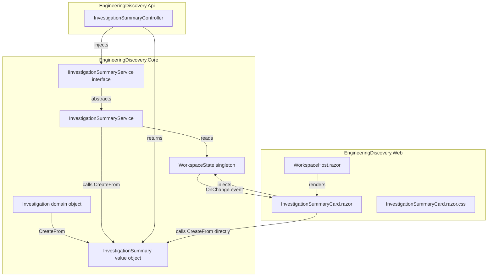
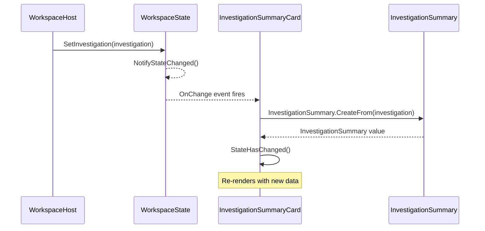
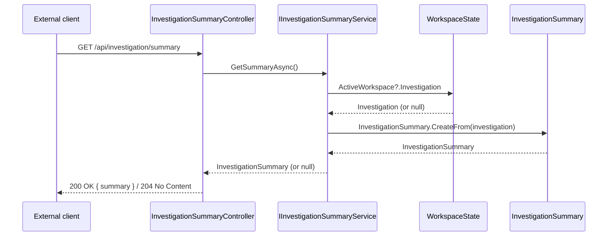

# Design Document: Investigation Summary

## Overview

The Investigation Summary feature surfaces a structured, data-driven summary of an `Investigation` to the
engineer. It answers the question _"What did the discovery engine find in this repository?"_ with a concise
set of quantitative metrics (project/namespace/type/member counts), a breakdown of engineering artifacts
categorised by type (layer violations, long methods, etc.), and a grouped findings list.

The feature spans two independently deliverable areas:

- **Core/API area** — a service interface (`IInvestigationSummaryService`) defined in `Core`, an
  implementation in `Core`, and an HTTP endpoint in `Api`. The Core domain already contains the
  `InvestigationSummary` value object and its `CreateFrom` factory; this area defines the application
  boundary, wraps the factory in a discoverable service, and exposes it through the API.

- **UI area** — a new Blazor component (`InvestigationSummaryCard`) rendered inside `WorkspaceHost`
  above the existing `InvestigationDashboard` explorer pane. It subscribes to `WorkspaceState.OnChange`
  and re-derives the summary whenever the active investigation changes. Refresh can also be triggered
  explicitly.

The two areas share the `InvestigationSummary` domain type as the contract. The UI area in the Blazor
Server app reads from `WorkspaceState` directly (in-process); the API endpoint is the boundary for
external or desktop host consumers.

---

## Architecture



**Key architectural decisions:**

1. `InvestigationSummary.CreateFrom` stays a pure static factory on the domain object — no behaviour
   is added to it in this feature.
2. `IInvestigationSummaryService` is defined in `Core.Services` and its implementation reads from
   `WorkspaceState`. This keeps the API from depending directly on the domain factory.
3. The Blazor UI does **not** call the HTTP API. It uses `WorkspaceState` in-process (same pattern as
   `InvestigationDashboard`). The API endpoint is the boundary for non-Blazor consumers.
4. No new state is stored; `InvestigationSummary` is derived on demand from the live `Investigation`.
5. Refresh is event-driven: `WorkspaceState.OnChange` fires whenever `SetInvestigation` is called,
   which already covers every post-discovery and post-import scenario.

---

## Sequence Diagrams

### Post-import refresh (Blazor)



### API request (external consumer)



---

## Components and Interfaces

### Component 1: `IInvestigationSummaryService` (Core)

**Location:** `EngineeringDiscovery.Core/Services/IInvestigationSummaryService.cs`

**Purpose:** Application boundary contract for obtaining the current investigation summary. Allows API
and future hosts to consume summary data without depending on `WorkspaceState` directly.

**Interface:**

```csharp
namespace EngineeringDiscovery.Core.Services
{
    /// <summary>
    /// Returns a derived summary of the current investigation. Returns null when no
    /// investigation is available. Implementations must not throw for a missing
    /// investigation; they must return null.
    /// </summary>
    public interface IInvestigationSummaryService
    {
        /// <summary>
        /// Returns an InvestigationSummary derived from the currently active Investigation,
        /// or null if no investigation is present.
        /// </summary>
        InvestigationSummary? GetSummary();
    }
}
```

**Responsibilities:**
- Define the contract for summary derivation visible at the application boundary.
- Remain sync (no `Task`/`async`) because derivation is pure computation with no I/O.

---

### Component 2: `InvestigationSummaryService` (Core)

**Location:** `EngineeringDiscovery.Core/Services/InvestigationSummaryService.cs`

**Purpose:** Implements `IInvestigationSummaryService` by reading the active investigation from
`WorkspaceState` and delegating to `InvestigationSummary.CreateFrom`.

**Interface:**

```csharp
namespace EngineeringDiscovery.Core.Services
{
    public sealed class InvestigationSummaryService : IInvestigationSummaryService
    {
        private readonly WorkspaceState _workspaceState;

        public InvestigationSummaryService(WorkspaceState workspaceState) { ... }

        public InvestigationSummary? GetSummary() { ... }
    }
}
```

**Responsibilities:**
- Null-guard: return `null` when `ActiveWorkspace` or `Investigation` is absent.
- Delegate to `InvestigationSummary.CreateFrom`; do not duplicate derivation logic.
- Registered as `Singleton` (matches `WorkspaceState` lifetime).

---

### Component 3: `InvestigationSummaryController` (Api)

**Location:** `EngineeringDiscovery.Api/Controllers/InvestigationSummaryController.cs`

**Purpose:** HTTP endpoint exposing the summary for external consumers.

**Interface:**

```csharp
[ApiController]
[Route("api/investigation")]
public sealed class InvestigationSummaryController : ControllerBase
{
    [HttpGet("summary")]
    public ActionResult<InvestigationSummary> GetSummary() { ... }
}
```

**Responsibilities:**
- Return `200 OK` with the `InvestigationSummary` body when a summary is available.
- Return `204 No Content` when no investigation exists (not a 404 — the resource exists but has no
  content yet).
- No business logic; all logic belongs in the service.

---

### Component 4: `InvestigationSummaryCard` (Web)

**Location:** `EngineeringDiscovery.Web/Components/Dashboard/InvestigationSummaryCard.razor`
**Scoped CSS:** `InvestigationSummaryCard.razor.css`

**Purpose:** Blazor component that displays the current investigation summary as a card with metrics
and artifact breakdown. Renders above `InvestigationDashboard` inside `WorkspaceHost`.

**Interface (parameters):**

```csharp
/// <summary>
/// Accepts an optional Investigation parameter. When null, the card renders in an
/// empty / not-yet-discovered state.
/// </summary>
[Parameter] public Investigation? Investigation { get; set; }
```

**Responsibilities:**
- Derive `InvestigationSummary` via `InvestigationSummary.CreateFrom(Investigation)` on each render.
- Display discovery metrics (projects, namespaces, types, members).
- Display engineering artifact summary grouped by severity class.
- Show a "No investigation" placeholder when `Investigation` is null.
- Never own or cache state; always re-derive from the parameter.
- Use CSS custom properties from `ed-shell.css`; no inline styles.

---

### Component 5: `WorkspaceHost` (update, Web)

`WorkspaceHost.razor` gains a new render block in the `"Explorer"` tab view, placed above the existing
`<InvestigationDashboard>` block:

```razor
@if (CurrentView == "Explorer")
{
    var inv = WorkspaceState.ActiveWorkspace?.Investigation;
    <InvestigationSummaryCard Investigation="inv" />

    @if (inv is not null && (inv.TypeObservations.Any() || ...))
    {
        <InvestigationDashboard Investigation="inv" />
    }
}
```

The component does not subscribe to any new events; the existing `WorkspaceState.OnChange`
subscription in `WorkspaceHost` triggers a `StateHasChanged()` that re-renders the new card.

---

## Data Models

### `InvestigationSummary` (existing, Core)

The existing value object — no changes required to its shape. Reproduced here as the shared contract:

```csharp
namespace EngineeringDiscovery.Core.Domain.Investigation
{
    public sealed class InvestigationSummary
    {
        // Identity
        public string RepositoryName { get; init; }

        // Discovery metrics
        public int ProjectCount { get; init; }
        public int NamespaceCount { get; init; }
        public int TypeCount { get; init; }
        public int MemberCount { get; init; }

        // Engineering artifact counts (one per ArtifactType)
        public int TotalArtifacts { get; init; }
        public int LayerViolations { get; init; }
        public int CircularProjectReferences { get; init; }
        public int EmptyControllers { get; init; }
        public int LongMethods { get; init; }
        public int ExcessiveParameterCount { get; init; }
        public int LargeConstructors { get; init; }
        public int AsyncNamingIssues { get; init; }
        public int LargePublicSurfaceAreas { get; init; }
        public int LargeTypes { get; init; }
        public int LargeInterfaces { get; init; }
        public int DeepInheritanceHierarchies { get; init; }
        public int ExcessivePublicFields { get; init; }
        public int MixedResponsibilities { get; init; }

        public static InvestigationSummary CreateFrom(Investigation investigation) { ... }
    }
}
```

**Validation rules:**
- All count properties are non-negative integers. `CreateFrom` guarantees this by using `.Count()` on
  nullable collections with null-coalescing defaults.
- `RepositoryName` is never null; it defaults to the raw path when the directory name cannot be parsed.

### Artifact severity classification (UI-only)

The `InvestigationSummaryCard` groups artifact types into two classes for visual rendering. This
classification lives entirely in the component — it is not part of the domain model:

```csharp
// UI-only grouping, not a domain concern
private static readonly HashSet<ArtifactType> ArchitecturalIssues = new()
{
    ArtifactType.LayerViolation,
    ArtifactType.CircularProjectReference
};

private static readonly HashSet<ArtifactType> CodeQualityIssues = new()
{
    ArtifactType.LongMethod,
    ArtifactType.ExcessiveParameterCount,
    ArtifactType.LargeConstructor,
    ArtifactType.AsyncNamingConvention,
    ArtifactType.LargePublicSurfaceArea,
    ArtifactType.LargeType,
    ArtifactType.LargeInterface,
    ArtifactType.DeepInheritance,
    ArtifactType.ExcessivePublicFields,
    ArtifactType.MixedResponsibilities,
    ArtifactType.EmptyController
};
```

---

## Algorithmic Pseudocode

### Algorithm 1: `InvestigationSummaryService.GetSummary`

```pascal
ALGORITHM GetSummary()
INPUT:  (none — reads from injected WorkspaceState)
OUTPUT: InvestigationSummary or null

BEGIN
  IF _workspaceState.ActiveWorkspace IS NULL THEN
    RETURN null
  END IF

  investigation ← _workspaceState.ActiveWorkspace.Investigation

  IF investigation IS NULL THEN
    RETURN null
  END IF

  RETURN InvestigationSummary.CreateFrom(investigation)
END
```

**Preconditions:**
- `_workspaceState` is non-null (guaranteed by DI constructor injection).

**Postconditions:**
- Returns `null` when no investigation is present — never throws.
- Returns a fully-populated `InvestigationSummary` when an investigation is available.
- The returned object is immutable (`init`-only properties).

---

### Algorithm 2: `InvestigationSummaryCard.DeriveDisplayModel`

This algorithm runs inside `OnParametersSet` to produce the render-facing view model from the
summary value.

```pascal
ALGORITHM DeriveDisplayModel(investigation)
INPUT:  investigation — Investigation or null
OUTPUT: (updates component fields: _summary, _discoveryItems, _artifactGroups)

BEGIN
  IF investigation IS NULL THEN
    _summary ← null
    _discoveryItems ← []
    _artifactGroups ← []
    RETURN
  END IF

  _summary ← InvestigationSummary.CreateFrom(investigation)

  _discoveryItems ← [
    ("Projects",   _summary.ProjectCount),
    ("Namespaces", _summary.NamespaceCount),
    ("Types",      _summary.TypeCount),
    ("Members",    _summary.MemberCount)
  ]

  IF _summary.TotalArtifacts > 0 THEN
    _artifactGroups ← []

    archCount ← _summary.LayerViolations + _summary.CircularProjectReferences
    IF archCount > 0 THEN
      _artifactGroups.Add(("Architectural", archCount, [
        ("Layer Violations",          _summary.LayerViolations),
        ("Circular Project Refs",     _summary.CircularProjectReferences)
      ]))
    END IF

    codeCount ← _summary.TotalArtifacts - archCount
    IF codeCount > 0 THEN
      codeItems ← []
      FOR EACH (label, value) IN code-quality pairs DO
        IF value > 0 THEN codeItems.Add((label, value)) END IF
      END FOR
      _artifactGroups.Add(("Code Quality", codeCount, codeItems))
    END IF
  ELSE
    _artifactGroups ← []
  END IF
END
```

**Preconditions:**
- `InvestigationSummary.CreateFrom` will not throw for a non-null investigation.

**Postconditions:**
- `_summary` is null if and only if `investigation` is null.
- `_discoveryItems` contains exactly 4 entries when `_summary` is non-null.
- `_artifactGroups` is empty when `TotalArtifacts == 0` or `investigation == null`.
- Artifact group items contain only entries with `value > 0` (zero counts are suppressed).

**Loop invariant (inner FOR loop):**
- Every item examined so far has either been added (value > 0) or suppressed (value == 0).

---

### Algorithm 3: `InvestigationSummaryController.GetSummary`

```pascal
ALGORITHM GetSummary()
INPUT:  (none — uses injected IInvestigationSummaryService)
OUTPUT: ActionResult

BEGIN
  summary ← _service.GetSummary()

  IF summary IS NULL THEN
    RETURN 204 No Content
  END IF

  RETURN 200 OK WITH body = summary
END
```

**Preconditions:**
- `_service` is non-null (DI constructor injection).

**Postconditions:**
- Returns `204 No Content` when no investigation is present (idempotent, safe for polling).
- Returns `200 OK` with the `InvestigationSummary` serialized as JSON when investigation exists.
- Never throws to the HTTP layer; `_service.GetSummary()` is null-safe by contract.

---

## Key Functions with Formal Specifications

### `IInvestigationSummaryService.GetSummary`

```csharp
InvestigationSummary? GetSummary();
```

**Preconditions:**
- Implementation has been registered and injected; the instance is non-null.

**Postconditions:**
- If `WorkspaceState.ActiveWorkspace == null`: returns `null`.
- If `WorkspaceState.ActiveWorkspace.Investigation == null`: returns `null`.
- Otherwise: returns `InvestigationSummary.CreateFrom(investigation)` — a non-null,
  fully-populated value object.
- Never throws an exception.

---

### `InvestigationSummary.CreateFrom` (existing — specification only)

```csharp
public static InvestigationSummary CreateFrom(Investigation investigation);
```

**Preconditions:**
- `investigation` is non-null (throws `ArgumentNullException` when null — existing behaviour).

**Postconditions:**
- All count fields (`ProjectCount`, `NamespaceCount`, `TypeCount`, `MemberCount`, and all artifact
  counts) are `>= 0`.
- `RepositoryName` is non-null.
- Returns a new `InvestigationSummary` with `init`-only properties; the investigation is not
  mutated.

---

### `InvestigationSummaryCard.OnParametersSet`

```csharp
protected override void OnParametersSet();
```

**Preconditions:**
- `Investigation` parameter may be null.

**Postconditions:**
- `_summary` reflects the current value of `Investigation` (null if investigation is null).
- `_discoveryItems` and `_artifactGroups` are consistent with `_summary`.
- No exceptions escape; `CreateFrom` is only called when `Investigation != null`.
- `StateHasChanged()` is **not** called here (Blazor calls it automatically after
  `OnParametersSet`).

---

## Example Usage

### Service registration (Core / Api DI)

```csharp
// In EngineeringDiscovery.Api/Program.cs (or a host extension method)
builder.Services.AddSingleton<IInvestigationSummaryService, InvestigationSummaryService>();
// WorkspaceState is already registered as Singleton by the host
```

### API call

```http
GET /api/investigation/summary HTTP/1.1
Host: localhost:5000
Accept: application/json

--- 200 OK ---
{
  "repositoryName": "EngineeringDiscovery",
  "projectCount": 6,
  "namespaceCount": 42,
  "typeCount": 218,
  "memberCount": 1340,
  "totalArtifacts": 7,
  "layerViolations": 0,
  "circularProjectReferences": 0,
  "emptyControllers": 1,
  "longMethods": 3,
  "excessiveParameterCount": 2,
  "largeConstructors": 1,
  "asyncNamingIssues": 0,
  "largePublicSurfaceAreas": 0,
  "largeTypes": 0,
  "largeInterfaces": 0,
  "deepInheritanceHierarchies": 0,
  "excessivePublicFields": 0,
  "mixedResponsibilities": 0
}

--- 204 No Content (no investigation yet) ---
```

### Blazor component usage in WorkspaceHost

```razor
@* WorkspaceHost.razor — Explorer tab *@
@if (CurrentView == "Explorer")
{
    var inv = WorkspaceState.ActiveWorkspace?.Investigation;

    <InvestigationSummaryCard Investigation="inv" />

    @if (inv is not null && (
            (inv.TypeObservations != null && inv.TypeObservations.Any()) ||
            (inv.NamespaceObservations != null && inv.NamespaceObservations.Any()) ||
            (inv.MemberObservations != null && inv.MemberObservations.Any())))
    {
        <InvestigationDashboard Investigation="inv" />
    }
}
```

### Summary card component (illustrative markup)

```razor
@* InvestigationSummaryCard.razor *@
@namespace EngineeringDiscovery.Web.Components.Dashboard
@using EngineeringDiscovery.Core.Domain.Investigation

@if (_summary is null)
{
    <div class="inv-summary-card inv-summary-card--empty">
        <p class="muted">No investigation yet. Import a repository to begin.</p>
    </div>
}
else
{
    <section class="inv-summary-card">
        <header class="inv-summary-header">
            <h3 class="inv-summary-repo">@_summary.RepositoryName</h3>
        </header>
        <div class="inv-summary-metrics">
            @foreach (var (label, count) in _discoveryItems)
            {
                <div class="card inv-summary-metric">
                    <span class="inv-metric-label">@label</span>
                    <strong class="inv-metric-value">@count</strong>
                </div>
            }
        </div>
        @if (_artifactGroups.Any())
        {
            <div class="inv-summary-artifacts">
                <h4 class="inv-artifacts-heading">Engineering Findings</h4>
                @foreach (var (groupName, total, items) in _artifactGroups)
                {
                    <div class="inv-artifact-group">
                        <h5 class="inv-artifact-group-name">@groupName <span class="inv-artifact-count">@total</span></h5>
                        <ul class="inv-artifact-list">
                            @foreach (var (itemLabel, itemCount) in items)
                            {
                                <li>@itemLabel <span class="inv-artifact-count">@itemCount</span></li>
                            }
                        </ul>
                    </div>
                }
            </div>
        }
    </section>
}
```

---

## Error Handling

### Scenario 1: Investigation is null when card renders

**Condition:** `WorkspaceState.ActiveWorkspace.Investigation` is null (repository imported but
discovery not yet run, or workspace just created).

**Response:** `InvestigationSummaryCard` renders the empty-state placeholder. `DeriveDisplayModel`
short-circuits and sets `_summary = null`.

**Recovery:** Automatic — `WorkspaceState.OnChange` fires when `SetInvestigation` is called;
`WorkspaceHost` re-renders and passes the new non-null investigation to the card.

---

### Scenario 2: `CreateFrom` throws an unexpected exception

**Condition:** A future regression in `InvestigationSummary.CreateFrom` causes an exception.

**Response:** The exception propagates through `OnParametersSet`. Blazor's circuit error handler
catches it and shows the component error boundary (if defined) or the default Blazor error UI.

**Design note:** The card should be wrapped in a `<ErrorBoundary>` by the caller (`WorkspaceHost`)
to isolate this from the rest of the dashboard. This is a UI-layer concern and is called out as a
requirement.

---

### Scenario 3: API called before investigation exists

**Condition:** Client calls `GET /api/investigation/summary` before any repository has been imported.

**Response:** `IInvestigationSummaryService.GetSummary()` returns null; controller returns
`204 No Content`. The client should treat this as "not yet available" and retry or poll.

**Recovery:** Client polls at its own discretion; a future SignalR or WebSocket notification is
out of scope for this feature.

---

### Scenario 4: Multiple imported repositories

**Condition:** `WorkspaceState.ActiveWorkspace.ImportedRepositories` contains more than one entry.
`WorkspaceState.ActiveWorkspace.Investigation` is the workspace-level investigation (currently
the last one set via `SetInvestigation`).

**Response:** `InvestigationSummaryService` reads `ActiveWorkspace.Investigation`, which is the
workspace-level convenience field. This is the same field consumed by `InvestigationDashboard` today,
so behaviour is consistent.

**Future evolution note:** If per-repository summaries are needed, `IInvestigationSummaryService`
should be extended to accept a repository path parameter. This is out of scope for this feature.

---

## Correctness Properties

### Property 1: `InvestigationSummaryService.GetSummary` — null-safety and derivation fidelity

**Null-safety:**
- ∀ state where `WorkspaceState.ActiveWorkspace == null` → `GetSummary()` returns `null` and does not throw.
- ∀ state where `WorkspaceState.ActiveWorkspace != null` ∧ `ActiveWorkspace.Investigation == null` → `GetSummary()` returns `null` and does not throw.

**Derivation fidelity:**
- ∀ investigation `i` where `i != null`: `GetSummary()` returns a value structurally equal to `InvestigationSummary.CreateFrom(i)`.
- The service introduces no additional transformation; it is a pure delegation to `CreateFrom`.

**Validates: Requirements 2.2, 2.3, 2.4**

---

### Property 2: `InvestigationSummary.CreateFrom` — non-negativity, consistency, idempotency, null guard

**Non-negativity:**
- ∀ valid investigation `i`: all count fields satisfy `ProjectCount ≥ 0`, `NamespaceCount ≥ 0`, `TypeCount ≥ 0`, `MemberCount ≥ 0`, and all individual artifact-type counts `≥ 0`.

**Consistency (TotalArtifacts == sum of individual counts):**
- ∀ valid investigation `i`:
  `TotalArtifacts == LayerViolations + CircularProjectReferences + EmptyControllers + LongMethods + ExcessiveParameterCount + LargeConstructors + AsyncNamingIssues + LargePublicSurfaceAreas + LargeTypes + LargeInterfaces + DeepInheritanceHierarchies + ExcessivePublicFields + MixedResponsibilities`

**Idempotency:**
- ∀ investigation `i`: `CreateFrom(i)` called twice on the same instance produces two values that are structurally equal (same field values). The investigation is not mutated.

**Null guard:**
- `CreateFrom(null)` always throws `ArgumentNullException`; it never returns a value.

**Validates: Requirements 1.1, 1.2, 1.3, 1.4, 1.5**

---

### Property 3: `InvestigationSummaryCard.OnParametersSet` — consistency between `_summary` and rendered output

**Null consistency:**
- `Investigation == null` ⟹ `_summary == null` ∧ `_discoveryItems` is empty ∧ `_artifactGroups` is empty ∧ the empty-state placeholder is rendered.
- `Investigation != null` ⟹ `_summary != null` ∧ `_discoveryItems` contains exactly 4 entries ∧ the summary card is rendered.

**Metric accuracy:**
- ∀ non-null investigation `i`: the four `_discoveryItems` entries correspond exactly to `(_summary.ProjectCount, _summary.NamespaceCount, _summary.TypeCount, _summary.MemberCount)` — no other values are substituted.

**Artifact suppression:**
- ∀ artifact-type counts `c`: an item appears in `_artifactGroups` if and only if `c > 0`. Zero-count artifact types are never rendered.

**Group total correctness:**
- The "Architectural" group total equals `LayerViolations + CircularProjectReferences`.
- The "Code Quality" group total equals `TotalArtifacts − (LayerViolations + CircularProjectReferences)`.
- Both group totals are consistent with the individual items listed within them.

**No side effects:**
- `OnParametersSet` does not call `StateHasChanged()` and does not mutate `WorkspaceState` or `InvestigationSummary`.

**Validates: Requirements 5.1, 5.2, 5.3, 5.4, 5.5, 5.6**

---

## Testing Strategy

### Unit testing approach

Each component is independently testable:

- **`InvestigationSummaryService`**: construct with a mock/stub `WorkspaceState`. Test
  null workspace → null, null investigation → null, populated investigation → correct summary.
- **`InvestigationSummaryController`**: mock `IInvestigationSummaryService`. Test null return →
  `204`, non-null return → `200` with correct body.
- **`InvestigationDashboard.razor.cs`**: existing tests cover `BuildViewModel`; no new test
  fixtures needed for the card since derivation delegates to the already-tested `CreateFrom`.

### Property-based testing approach

**Property test library:** `xUnit` with `FsCheck` or `CsCheck` (matches existing .NET test
ecosystem; no existing property-based test infrastructure identified, so introduce minimally).

**Key properties to verify for `InvestigationSummary.CreateFrom`:**

1. **Non-negativity**: For any valid `Investigation`, all count fields are `>= 0`.
2. **Consistency**: `TotalArtifacts == sum of all individual artifact-type counts`.
3. **Idempotency**: `CreateFrom(inv) == CreateFrom(inv)` for the same investigation instance
   (structural equality, not reference equality — requires `IEquatable` or value comparison).
4. **Null guard**: `CreateFrom(null)` always throws `ArgumentNullException`.

### Integration testing approach

- `WorkspaceHost` + `InvestigationSummaryCard` end-to-end render test using
  `bUnit` (Blazor component testing library already present in the `Web.Tests` project if
  available, otherwise add as a test dependency).
- Test: render `WorkspaceHost` with a pre-populated `WorkspaceState`; assert the
  `InvestigationSummaryCard` is present in the output and displays the correct counts.
- Test: render with `Investigation = null`; assert the empty-state placeholder is rendered.
- Test: simulate `WorkspaceState.OnChange`; assert the card re-renders with updated counts.

---

## Performance Considerations

- `InvestigationSummary.CreateFrom` performs multiple LINQ passes over the observation collections.
  For typical repositories (hundreds to low thousands of types) this is sub-millisecond and runs
  synchronously on the render thread — acceptable.
- The card re-derives the summary on every `OnParametersSet` call. Since `WorkspaceState.OnChange`
  only fires on explicit investigation changes (not on every state mutation), this is bounded to
  import events and explicit refreshes.
- If performance degrades with very large repositories (tens of thousands of types), the derivation
  can be memoised by caching the last `investigation.Id` and only re-computing when it changes.
  This optimisation is not required for v1 and is called out as a future improvement.

---

## Security Considerations

- The `GET /api/investigation/summary` endpoint returns derived structural information about the
  repository. In a shared or hosted deployment this is sensitive (it reveals project/type counts and
  code quality findings). Authentication and authorisation policy should be applied at the API host
  level — this is outside the scope of this feature but must be called out as a requirement for
  production use.
- No user-supplied input is processed by the summary derivation; all data originates from the
  already-imported investigation. No injection or sanitisation concerns.

---

## Dependencies

| Dependency | Type | Reason |
|---|---|---|
| `EngineeringDiscovery.Core.Domain.Investigation.InvestigationSummary` | Existing | Primary data contract |
| `EngineeringDiscovery.Core.Services.WorkspaceState` | Existing | Source of active investigation |
| `Microsoft.AspNetCore.Mvc` | Existing in Api | Controller base class |
| `Microsoft.AspNetCore.Components` | Existing in Web | Blazor component base |
| `bUnit` | New test-only | Blazor component integration testing |

No new NuGet packages are required for the production code paths. `bUnit` is a test-only addition
and only if it is not already present in `Web.Tests`.
